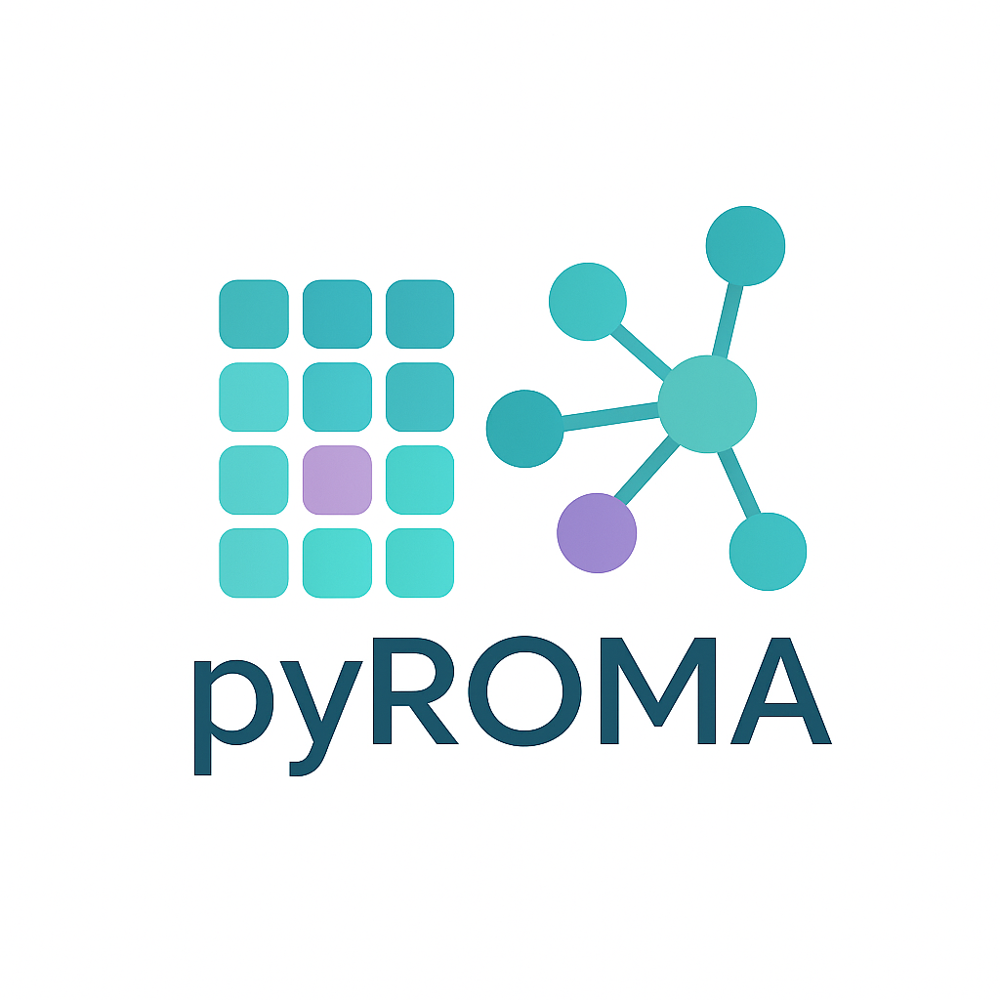

.. pyROMA documentation master file, created by
   sphinx-quickstart on Fri May  9 12:35:47 2025.
   You can adapt this file completely to your liking, but it should at least
   contain the root `toctree` directive.

Welcome to pyROMA's documentation!
==================================

.. toctree::
   :maxdepth: 2
   :caption: Contents:
   
   usage
   tutorials/index
   api

